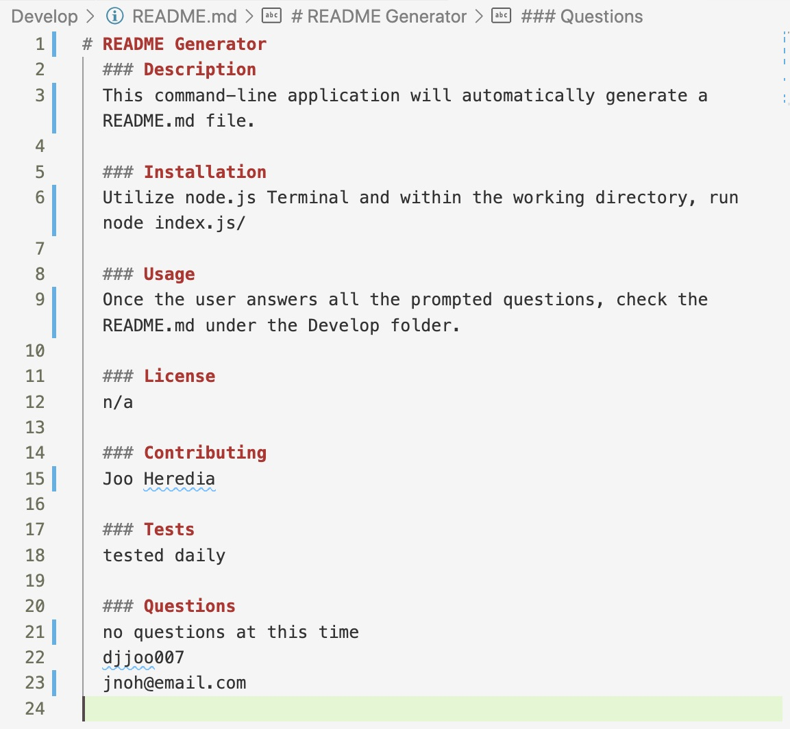

# README Generator (Unit 09 Node.js and ES6+)

### Usage
This command-line application will automatically generate a README.md file once the user answers all prompted questions.

### Installation
- Utilize Node.js Terminal

- Within the working directory, run the following command:
    node index.js 

- Answer all the prompted Questions

### Link
All answered questions will be shown under /Develop/README.md

https://drive.google.com/file/d/1FO3hG_e-cpJ-9eG3UsQSfE4XAIf5hqIL/view?usp=sharing

### Screenshot

